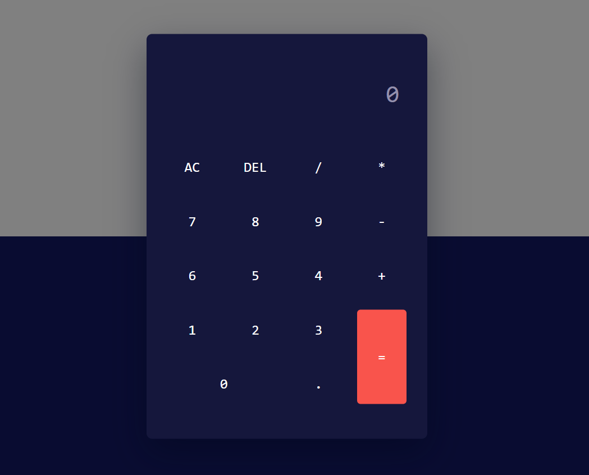

# 🧮 Calculator App

🔗 Live Demo:https://sravanicalculator.netlify.app/

A simple and interactive web-based calculator that performs basic arithmetic operations like addition, subtraction, multiplication, and division.

This app is built with HTML, CSS, and JavaScript and is lightweight, responsive, and easy to use.

## 🚀 Features

- 🔢 Perform basic arithmetic operations: +, -, ×, ÷

- 🖱️ User-friendly interface with clickable buttons

- ⌨️ Supports keyboard input for faster calculation

- 🖼️ Clean and responsive UI for both desktop and mobile

## 🛠️ Technologies Used

- HTML – Webpage structure

- CSS – Styling, layout, and responsive design

- JavaScript – Logic for calculations

## 🧠 How It Works

- User clicks numbers and operation buttons

- The JavaScript logic calculates the result based on input

- The result is displayed dynamically on the screen

## 📸 Demo Screenshots

## 🧪 How to Use It Locally

1. Clone the repository:

   git clone https://github.com/SravaniMuduru/Calculator.git

2. Navigate to the project folder:

   cd Calculator

3. Open the project in your browser:

Simply double-click index.html or open it in your preferred browser

## 💡 Future Enhancements

- Add scientific calculator functions (square root, percentage, etc.)

- Support for keyboard shortcuts for all operations

- Add a dark mode toggle for better accessibility

- Improve mobile-first UI and animations
